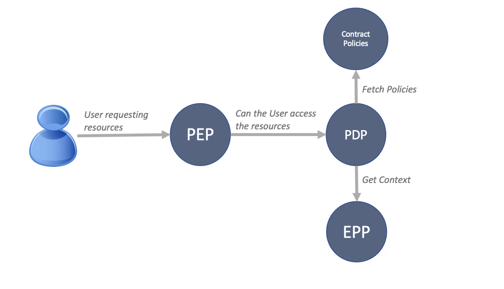

# ACS
Access Control system is a system for fine-grained, dynamic authorization. It can evaluate user identity, contract, ressource and context to make realtime decisions.

The Access Control System API request and response flow is represented below.

## **Policy Decision Point**
This mechanism evaluates the access requests to resources against the authorization policies available in a contract to determine whether specific access should be granted to a user who issued the request.
The Policy decision point API provides a standards-based HTTP REST API for decisions determined on the contract policies.

## **Policy Enforcement Point**
This mechanism is responsible for receiving authorization requests sent later to the policy decision point for evaluation. It also evaluates an authorization decision made by the Policy Decision Point and doesn't require any authorization logic.

## **Event Processing Point**
This mechanism is responsible for tracking and analyzing the data about the activities occurring in the Swiss Data Custodian and aggregate them to represent the state of the Swiss Data Custodian.
