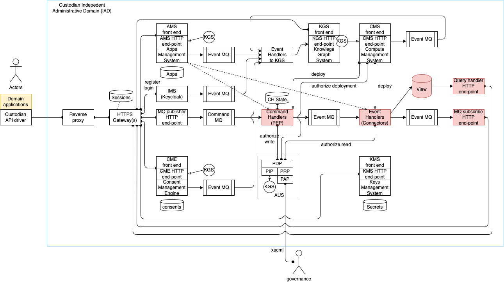

# Swiss Data Custodian overview

The Swiss Data Custodian is an open platform for governing data access and processing.
It enables to separate data from its usage, so you can get insight from data without the burden of data protection law compliance.
By taking advantage of The Swiss Data Custodian for sharing data, governing data access, you can significantly reduce the delay between accessing third-party data, law compliance and consuming data.

# Architecture

